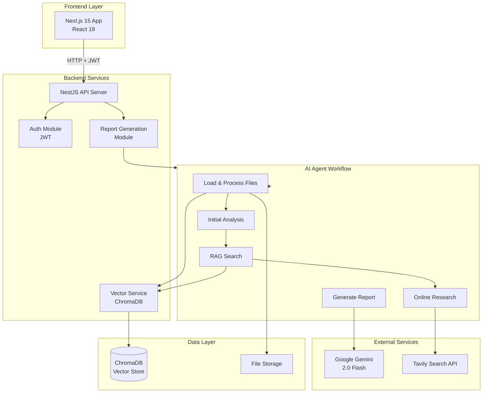
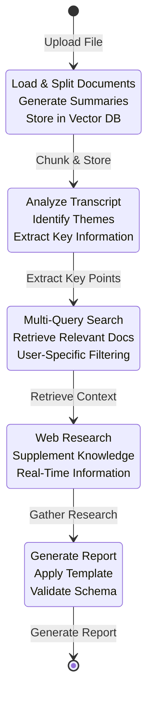

# LangGraph-based Report Generation System

<p align="center">
  <strong>AI Agent Workflows | RAG System | Vector Database</strong>
</p>

<p align="center">
  <a href="#features">Features</a> •
  <a href="#architecture">Architecture</a> •
  <a href="#tech-stack">Tech Stack</a> •
  <a href="#getting-started">Getting Started</a> •
  <a href="#api-documentation">API Docs</a> •
  <a href="#contributing">Contributing</a>
</p>

---

## Overview

LangGraph-based Report Generation System is an enterprise-grade AI system that demonstrates how to build intelligent report generation workflows using LangGraph, RAG (Retrieval-Augmented Generation), and vector database technology. This technical showcase demonstrates advanced software engineering practices in production AI applications.

### Key Highlights

- 🤖 **AI Agent Workflows**: Multi-stage LangGraph-based agent pipeline for intelligent report generation
- 🔍 **RAG System**: Multi-query retrieval from vector database for context-aware generation
- 📊 **Vector Database**: ChromaDB integration with advanced semantic search capabilities
- 🏗️ **Microservices Architecture**: Scalable NestJS backend with Next.js frontend
- 🔐 **Enterprise Security**: JWT authentication with user isolation
- 📝 **Structured Output**: Schema-validated report generation using Zod

## Features

### Core Capabilities

- **Intelligent Report Generation**: Transforms audio transcriptions into structured medical reports using AI agents
- **RAG-Enhanced Writing**: Leverages uploaded professional materials and knowledge bases for accurate content
- **Multi-Source Research**: Combines local knowledge base search with online research via Tavily API
- **Template-Based Output**: Flexible JSON schema templates for customizable report structures
- **Real-Time Processing**: Asynchronous workflow execution with state management
- **User Isolation**: Secure multi-tenant architecture with per-user vector database filtering

### Technical Features

- **LangGraph State Machine**: Complex workflow orchestration with state channels
- **Multi-Query Retrieval**: Optimized RAG with query expansion and reranking
- **Document Processing**: Support for PDF, DOCX, TXT, and JSON formats
- **Text Chunking**: Intelligent document splitting with overlap for context preservation
- **Error Handling**: Comprehensive error management with custom exceptions
- **API Documentation**: Swagger/OpenAPI integration for interactive API exploration

## Architecture

### System Overview



### Agent Workflow



### Component Architecture

- **Auth Module**: JWT-based authentication with Passport.js strategies
- **Report Generation Module**: Core business logic with LangGraph workflow
- **Vector Service**: ChromaDB integration with embeddings and retrieval
- **Agent Components**: Modular services for each workflow stage
- **Frontend Demo**: Next.js application demonstrating API integration

## Tech Stack

### Backend

- **Framework**: NestJS 10.x (TypeScript)
- **AI/ML**:
  - LangChain & LangGraph for agent orchestration
  - Google Gemini 2.0 Flash for LLM inference
  - ChromaDB for vector storage
  - Multi-Query Retriever for RAG optimization
- **Authentication**: JWT (Passport.js)
- **Database**: ChromaDB (vector database)
- **Document Processing**: PDF, DOCX, TXT, JSON loaders
- **API Documentation**: Swagger/OpenAPI

### Frontend

- **Framework**: Next.js 15 (App Router)
- **UI Library**: React 19
- **Styling**: Tailwind CSS
- **State Management**: React Hooks

### Infrastructure

- **Containerization**: Docker & Docker Compose
- **Runtime**: Node.js
- **Package Management**: npm/yarn

## Getting Started

### Prerequisites

- Node.js 18+ and npm/yarn
- Docker and Docker Compose
- Google Gemini API key (or compatible proxy)
- Tavily API key (for online search)
- ChromaDB (included in Docker Compose)

### Installation

1. **Clone the repository**
   ```bash
   git clone https://github.com/your-username/langgraph-report-generation.git
   cd langgraph-report-generation
   ```

2. **Configure environment variables**
   ```bash
   cp .env.example .env
   # Edit .env with your API keys and configuration
   ```

3. **Start with Docker Compose**
   ```bash
   docker-compose up -d --build
   ```

4. **Access the application**
   - Frontend: http://localhost:3001
   - Backend API: http://localhost:3000/api
   - API Documentation: http://localhost:3000/api-doc
   - ChromaDB: http://localhost:8000

### Development Setup

1. **Install dependencies**
   ```bash
   npm install
   ```

2. **Start backend in development mode**
   ```bash
   npm run start:dev
   ```

3. **Start frontend in development mode**
   ```bash
   cd front-demo/inscrib_api_demo
   npm run dev
   ```

4. **Run tests**
   ```bash
   npm test
   npm run test:cov
   ```

## API Documentation

Interactive API documentation is available at `/api-doc` when the server is running. The API includes:

- **Authentication**: JWT token generation and validation
- **File Upload**: Multi-format document upload
- **Report Generation**: Trigger AI-powered report generation
- **Vector Operations**: Knowledge base management
- **Report Regeneration**: Partial report section updates

### Example API Usage

```typescript
// 1. Get authentication token
const tokenResponse = await fetch('/api/auth/token?id=user123', {
  method: 'POST'
});
const { access_token } = await tokenResponse.json();

// 2. Upload transcript file
const formData = new FormData();
formData.append('file', transcriptFile);
const uploadResponse = await fetch('/api/report-generation/upload', {
  method: 'POST',
  headers: { Authorization: `Bearer ${access_token}` },
  body: formData
});

// 3. Generate report
const reportResponse = await fetch(
  `/api/report-generation/generate?UploadFile=${filePath}&TemplatePath=${templateUrl}`,
  {
    headers: { Authorization: `Bearer ${access_token}` }
  }
);
```

## Project Structure

```
langgraph-report-generation/
├── apps/
│   └── inscrib_agent/          # NestJS backend application
│       └── src/
│           ├── auth/           # Authentication module
│           ├── report-generation/  # Core report generation
│           │   └── components/    # Agent workflow components
│           ├── vector/         # Vector database service
│           └── main.ts         # Application entry point
├── front-demo/
│   └── inscrib_api_demo/       # Next.js frontend demo
├── docs/                       # Documentation
├── docker-compose.yml          # Docker orchestration
└── README.md                   # This file
```

## Performance Considerations

- **Vector Search**: Optimized with multi-query retrieval and semantic reranking
- **Document Processing**: Parallel chunk processing with async/await
- **Agent Workflow**: Stateful execution with efficient state management
- **Database**: ChromaDB with HNSW indexing for fast similarity search

## Security

- JWT-based authentication with configurable expiration
- User isolation in vector database queries
- CORS configuration for allowed origins
- File type validation for uploads
- Input sanitization and validation

## Contributing

We welcome contributions! Please see [CONTRIBUTING.md](CONTRIBUTING.md) for guidelines.

1. Fork the repository
2. Create a feature branch (`git checkout -b feature/amazing-feature`)
3. Commit your changes (`git commit -m 'Add amazing feature'`)
4. Push to the branch (`git push origin feature/amazing-feature`)
5. Open a Pull Request

## License

This project is licensed under the MIT License - see the [LICENSE](LICENSE) file for details.

## Acknowledgments

- Built with [LangChain](https://www.langchain.com/) and [LangGraph](https://github.com/langchain-ai/langgraph)
- Powered by [Google Gemini 2.0 Flash](https://deepmind.google/technologies/gemini/)
- Vector storage by [ChromaDB](https://www.trychroma.com/)

## Contact

For questions or inquiries, please open an issue on GitHub.

---

<p align="center">A technical showcase of LangGraph-based AI agent workflows</p>
