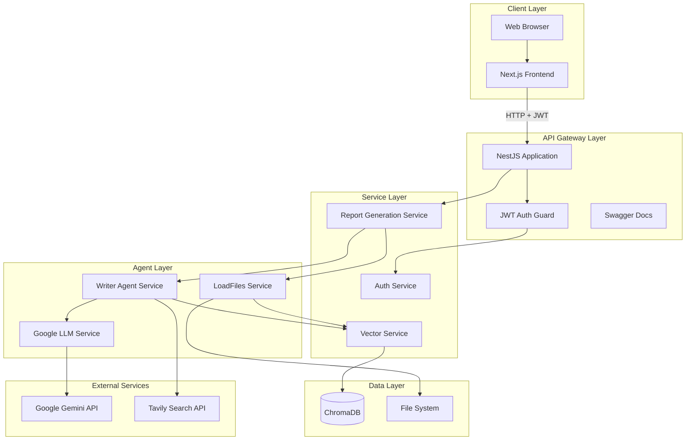
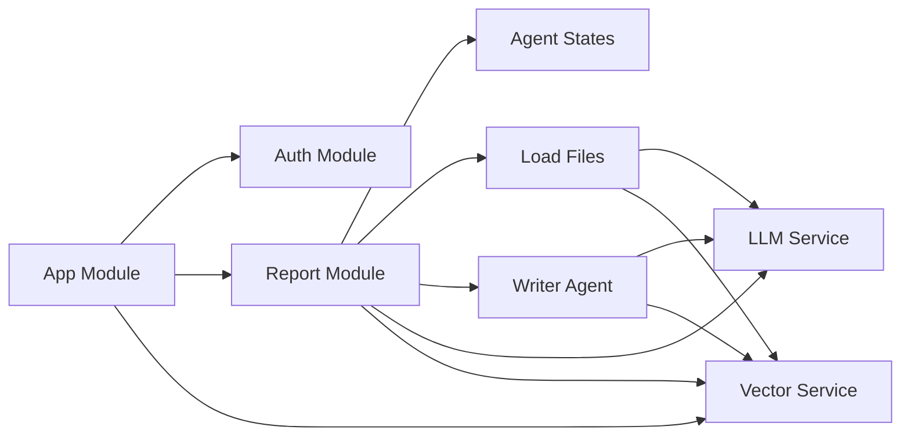
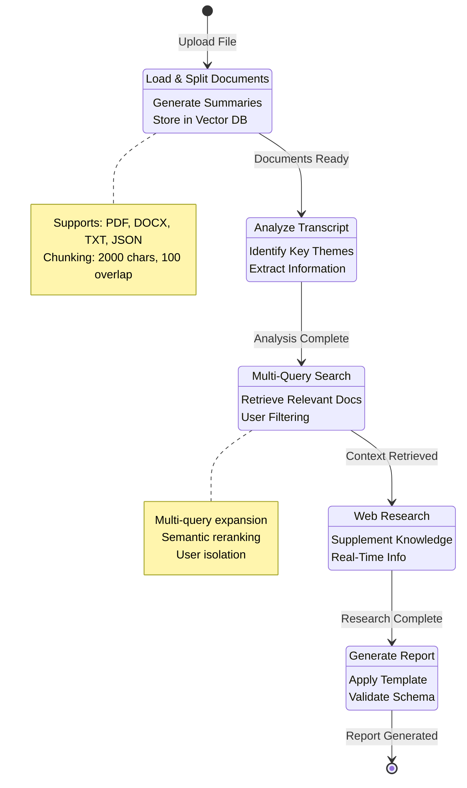
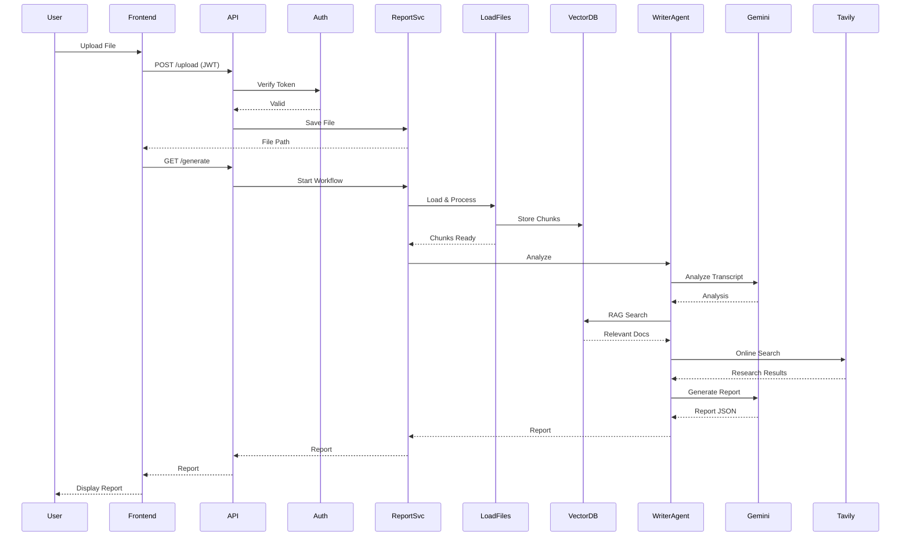
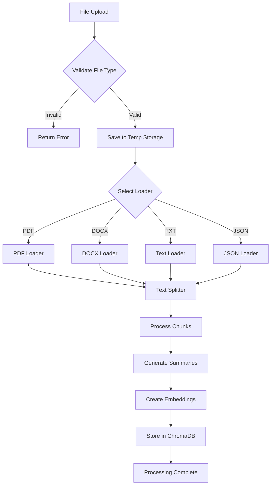
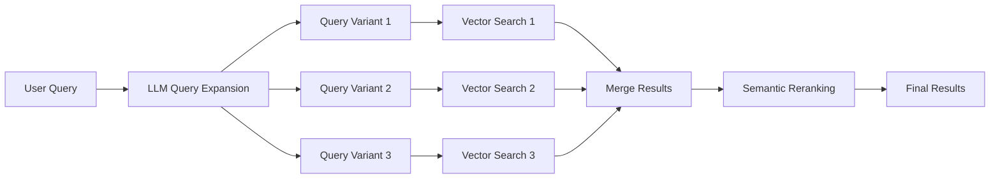
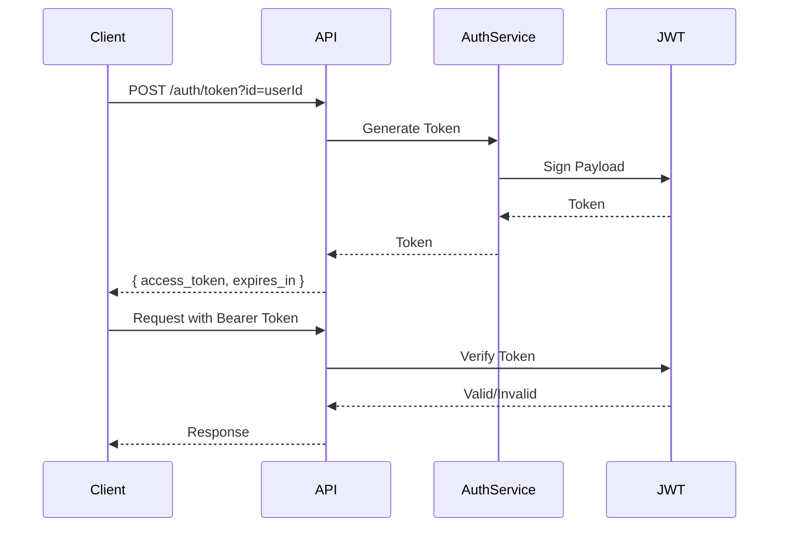
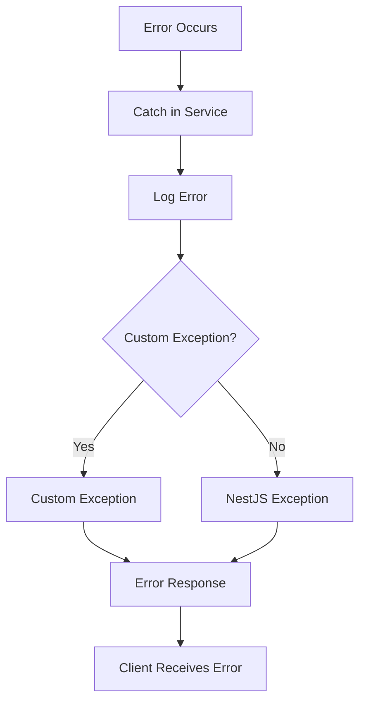
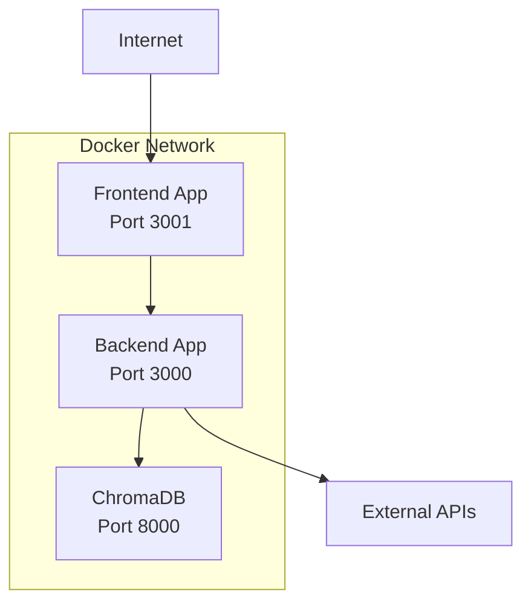

# System Architecture

This document provides a comprehensive overview of the LangGraph-based Report Generation System architecture, including component interactions, data flows, and design decisions.

## Table of Contents

1. [System Overview](#system-overview)
2. [Component Architecture](#component-architecture)
3. [Agent Workflow](#agent-workflow)
4. [Data Flow](#data-flow)
5. [RAG Pipeline](#rag-pipeline)
6. [Vector Database Schema](#vector-database-schema)
7. [Security Architecture](#security-architecture)
8. [Performance Considerations](#performance-considerations)

## System Overview

LangGraph-based Report Generation System is built as a microservices architecture with clear separation of concerns:

- **Frontend Layer**: Next.js application for user interaction
- **API Layer**: NestJS RESTful API with JWT authentication
- **Business Logic Layer**: Modular services for report generation
- **AI Agent Layer**: LangGraph-based workflow orchestration
- **Data Layer**: ChromaDB vector database for knowledge storage
- **External Services**: Google Gemini LLM and Tavily Search API

## Component Architecture

### High-Level Component Diagram



### Module Dependencies



## Agent Workflow

### LangGraph State Machine

The report generation process is orchestrated using LangGraph, which provides a stateful workflow with clear state transitions:



### State Channels

The workflow uses LangGraph state channels to manage data flow:

```typescript
interface AgentStateChannels {
  UploadFile: string;           // File path
  TemplatePath: string;        // Template JSON
  messages: BaseMessage[];      // LLM conversation history
  Status: string;              // Current workflow status
  Chunks?: Document[];          // Processed document chunks
  Error?: string;               // Error messages
  userId?: string;              // User identifier
  RAGResults?: object;          // RAG search results
  Report?: object;              // Generated report
  Analysis?: string;            // Analysis results
  Research?: string;            // Research results
  MetaData: {                   // Workflow metadata
    startTime: number;
    lastUpdated: number;
  };
}
```

## Data Flow

### Report Generation Flow



### File Processing Flow



## RAG Pipeline

### Multi-Query Retrieval Process

The system uses LangChain's Multi-Query Retriever to improve retrieval quality:



### RAG Search Implementation

1. **Query Expansion**: LLM generates multiple query variants
2. **Parallel Search**: Execute searches for each variant
3. **Result Merging**: Combine and deduplicate results
4. **Reranking**: Semantic scoring for relevance
5. **Filtering**: User-specific document filtering

## Vector Database Schema

### ChromaDB Collection Structure

```typescript
interface DocumentMetadata {
  filename: string;        // Original filename
  source: string;          // User ID for isolation
  summary?: string;        // LLM-generated summary
  chunkIndex?: number;     // Chunk position in document
  pageNumber?: number;     // Page number (for PDFs)
}

interface Document {
  id: string;              // Unique document ID
  pageContent: string;     // Document text content
  metadata: DocumentMetadata;
  embedding: number[];     // Vector embedding
}
```

### Collection Configuration

- **Distance Metric**: Cosine similarity
- **Index Type**: HNSW (Hierarchical Navigable Small World)
- **Construction EF**: 100 (index building)
- **Search EF**: 10 (query search)

## Security Architecture

### Authentication Flow



### User Isolation

- **Vector Database**: Documents filtered by `source` field (user ID)
- **File Storage**: User-specific temporary file paths
- **Token Validation**: JWT contains user ID for authorization
- **CORS**: Restricted to allowed origins

## Performance Considerations

### Optimization Strategies

1. **Parallel Processing**
   - Document chunks processed in parallel
   - Multiple RAG queries executed concurrently
   - Async/await for non-blocking operations

2. **Caching**
   - LLM responses cached where appropriate
   - Vector search results cached for repeated queries
   - Template parsing cached

3. **Database Optimization**
   - HNSW index for fast similarity search
   - Batch document insertion
   - Connection pooling

4. **Resource Management**
   - Temporary file cleanup
   - Memory-efficient chunk processing
   - Connection retry logic

### Scalability

- **Horizontal Scaling**: Stateless API design allows multiple instances
- **Database Scaling**: ChromaDB supports distributed deployment
- **Load Balancing**: Can be placed behind reverse proxy
- **Async Processing**: Long-running tasks can be moved to queue system

## Error Handling

### Error Propagation



### Error Types

- **ValidationError**: Invalid input data
- **FileProcessingError**: Document processing failures
- **LLMError**: LLM API failures
- **VectorDBError**: Database connection/query errors
- **AuthenticationError**: JWT validation failures

## Deployment Architecture

### Docker Compose Services



### Service Communication

- **Frontend ↔ Backend**: HTTP/REST over Docker network
- **Backend ↔ ChromaDB**: HTTP API calls
- **Backend ↔ External APIs**: HTTPS requests
- **Internal Services**: Direct method calls (same process)

## Future Enhancements

1. **Queue System**: Move long-running tasks to background queue
2. **Caching Layer**: Redis for frequently accessed data
3. **Monitoring**: Application performance monitoring (APM)
4. **Logging**: Centralized logging with ELK stack
5. **Rate Limiting**: API rate limiting per user
6. **Webhooks**: Event-driven architecture for integrations

